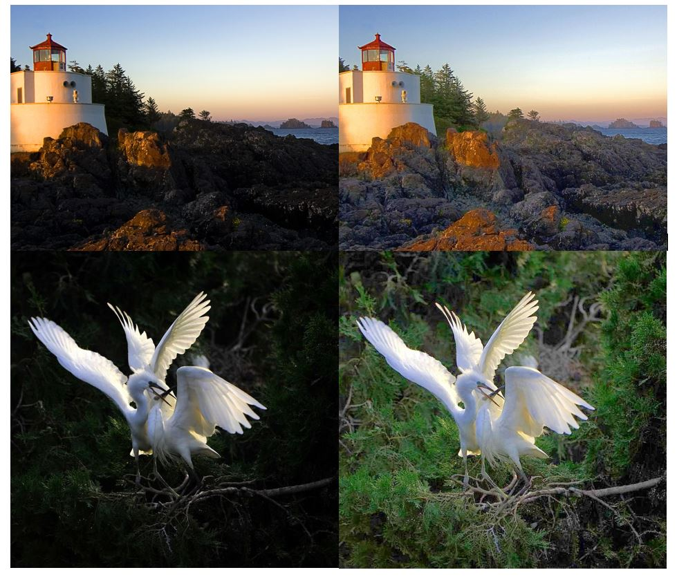

# low-light-enhancement via RBHF (Region-based Histogram & Fusion)
MSc. research in image processing.
By Shaffa K. Kokro Jr., 5th March 2023
% Supervised by Prof. Elijah Mwangi 
% And Prof. George Kamucha
% Department of Electrical & Information Engineering
% University of Nairobi

## About
Our method enhances a single low-light image using region-based histogram specification & DWT image fusion. 
The algorithm improves the perceptual quality of captured low-light photos and results in no colour distortion or artefacts.

## Enhancement results

Examples here shown at low resolution.

Simulation results - Google Drive:
[link](https://drive.google.com/drive/folders/1Cb5LBf3JiBvwkq_5pr3VF-105Ez56MoO?usp=sharing)
